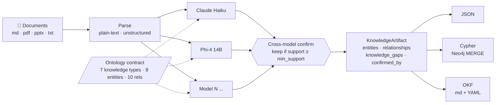

# KnowHub

**A model-agnostic pipeline for turning implementation documents into a cross-confirmed knowledge graph.**

KnowHub reads guides, blog posts, PDFs, and decks — the messy long-form content that captures how something actually gets implemented — and compiles them into structured, provenance-tagged knowledge artefacts you can trust, query, and cite.

## Workflow



**Read left-to-right:** documents are parsed, then extracted independently by every configured LLM against the same ontology contract. The confirmation step merges candidates and keeps only relationships that survive cross-model support. The resulting artefact — including provenance and knowledge gaps — is then written out in any combination of JSON, Cypher, or OKF.

---

## Why KnowHub

Most "knowledge from documents" tools either scrape into an unstructured vector store and hope RAG retrieves the right chunk, or run one LLM once and call the output a graph. Both patterns fail on implementation content, where the same idea is expressed differently across documents, warnings matter, and a wrong relationship is worse than a missing one.

KnowHub takes a different position:

- **Model-agnostic, tuned-profile based, cross-confirmed.** Claude, Phi-4, Mistral, or a future model — all extract against the same ontology, and only relationships that survive cross-model confirmation ship.
- **An ontology built for implementation knowledge.** Decisions, tradeoffs, prerequisites, outcomes, and diagnostic warnings — not generic entities and generic edges.
- **Knowledge gaps are first-class.** If a model can't populate required properties for a relationship, it must emit a gap, not a partial edge.
- **Provenance is preserved.** Every relationship records which models confirmed it, so downstream consumers can filter by confidence.

If you're building trustworthy AI answers over technical or implementation content, KnowHub is the compilation layer beneath that.

---

## Concepts

### The ontology contract

Every extractor works against the same contract (see [`knowhub/prompts.py`](knowhub/prompts.py)):

**Knowledge types** — Comparative, Contextual, Diagnostic, Procedural, Conceptual, Experiential, Referential

**Entity types** — Product, Feature, Decision, Persona, Prerequisite, Outcome, Concept, Integration

**Relationship types** — REQUIRES, ENABLES, CONFLICTS_WITH, TRADEOFF, RECOMMENDED_WHEN, IMPACTS, PRODUCES, SUPERSEDES, PRECEDES, PERFORMED_BY

Some relationship types have required properties:

| Relationship | Required properties |
|---|---|
| `TRADEOFF` | `gives`, `costs` |
| `RECOMMENDED_WHEN` | `context` |
| `CONFLICTS_WITH` | `severity`, `notes` |

If a model can't fill these, it must emit a `knowledge_gap` instead of a half-formed edge.

### Cross-confirmation

Trusted KnowHub runs require **at least two tuned LLM clients**. Each extracts independently; the confirmation step merges candidates, tracks which models supported each relationship, and only keeps relationships with support ≥ `--min-support` (default 2).

Single-LLM runs are allowed for tests and development via `allow_single_llm_for_testing=True`, but they are **not trustworthy output.**

The full rationale, tuning profiles, and evaluation checklist are in [`docs/llm-tuning.md`](docs/llm-tuning.md).

---

## Architecture

```
knowhub/                       Core library
├── schema.py                  KnowledgeArtifact, Entity, Relationship, KnowledgeGap
├── prompts.py                 Ontology contract + tuning profiles (frontier / local_reasoning / local_schema)
├── extraction.py              KnowledgeExtractor — one model, one document, one artifact
├── validation.py              Schema and ontology validation
├── confirmation.py            Cross-model merge + support counting
├── compiler.py                compile_file / compile_directory — the top-level pipeline
├── parsers/                   plain_text, unstructured_adapter (Unstructured.io)
├── llms/                      anthropic_client, ollama_client, static (for tests)
└── exporters/                 json, cypher (Neo4j), okf (Open Knowledge Format)

ingest/                        Corpus-scale ingestion (crawler → consensus → Neo4j)
├── crawler.py                 Walk a directory tree for .md files
├── extractors/                Model-specific adapters (claude, phi4, mistral, gemma)
├── reconcilers/               Reconciliation strategies
├── consensus.py               Multi-model, multi-run consensus
├── preprocessor.py            Unstructured.io preprocessing
├── loader.py                  Neo4j MERGE loader
├── pipeline.py                End-to-end pipeline runner
└── eval/                      Evaluation harness + excerpts + results

knowhub_cli.py                 Main CLI entry point
```

The library (`knowhub/`) is designed for embedding — call `compile_file()` from your own code. The `ingest/` package is a reference corpus-scale pipeline that uses the library.

---

## Quickstart

### Install

```bash
git clone https://github.com/smgam29/knowhub.git
cd knowhub
python3.11 -m venv venv
source venv/bin/activate
pip install -r requirements.txt
cp .env.example .env  # add your Anthropic key + Neo4j credentials if you're using them
```

### Run the demo

The `demo` LLM client produces canned output from two synthetic models, so you can see the full compile → confirm → export flow without any API keys:

```bash
python knowhub_cli.py examples/demo/prompt-customization.txt \
    --llm demo \
    --export json --export cypher --export okf \
    --out build/demo
```

You'll get:

- `build/demo/artifact.json` — the confirmed artefact
- `build/demo/graph.cypher` — Neo4j MERGE statements
- `build/demo/okf/` — Open Knowledge Format markdown files

### Run against a real document with cross-confirmation

```bash
python knowhub_cli.py path/to/doc.md \
    --parser unstructured \
    --llm anthropic:claude-haiku-4-5 \
    --llm ollama:phi4:14b \
    --min-support 2 \
    --export json \
    --verbose \
    --out build/run1
```

---

## CLI reference

```
python knowhub_cli.py <path> [options]

  path                         File or directory to compile

  --parser {plain-text,unstructured}   Parser adapter (default: plain-text)
  --llm <spec>                 Repeatable. Options:
                                 demo
                                 anthropic
                                 anthropic:<model>
                                 ollama:<model>
  --export {json,cypher,okf}   Repeatable. Default: json
  --out <dir>                  Output directory (default: build/knowhub)
  --min-support <n>            Min distinct model support for a relationship (default: 2)
  --ollama-timeout <sec>       Per-model read timeout for Ollama (default: 600)
  --verbose                    Log each model call
  --export-candidates          Also emit per-model raw candidates for debugging
```

---

## LLM support

KnowHub is BYO LLM. Any provider can be added behind the [`LLMClient`](knowhub/llms/base.py) interface. Adapters shipped in the repo:

- `AnthropicClient` — Claude via the official SDK
- `OllamaClient` — any local Ollama model
- `StaticLLMClient` — returns fixed JSON, used for tests ONLY

### Current tuned profiles

From the prototype evaluation (see `ingest/eval/`):

| Model | Role | Status |
|---|---|---|
| Claude Haiku | Primary extractor (API) | Tuned prototype |
| Phi-4 14B (Ollama) | Secondary extractor (local) | Tuned prototype — best local from eval |
| Mistral 7B (Ollama) | Reconciler | Tuned prototype |
| Qwen3 8B (Ollama) | Candidate extractor | Experimental |
| gpt-oss 20B (Ollama) | Candidate extractor | Not recommended |
| Gemma 3 4B (Ollama) | Superseded by Phi-4 | Retained for reference |

These are project-specific findings, not universal rankings. Full evaluation criteria and passing thresholds are in [`docs/llm-tuning.md`](docs/llm-tuning.md).

### Choosing a model for your setup

KnowHub's local Ollama support means the ceiling on quality is really the ceiling on your hardware. Rough guidance for what's viable at each tier:

| Hardware | Model size | Examples | Fit for KnowHub |
|---|---|---|---|
| 8 GB VRAM / 16 GB unified | 7–8B | Mistral 7B, Qwen3 8B, Llama 3.1 8B | Usable as a cross-confirmation partner. Weaker on ontology adherence — expect more knowledge gaps than confirmed edges. |
| 16–24 GB VRAM / 32 GB unified | 13–14B | **Phi-4 14B**, Qwen3 14B, Mistral Small | Current sweet spot. Phi-4 14B is the best local extractor in KnowHub's initial eval. |
| 24–48 GB VRAM / 64 GB unified | 27–32B | Qwen3 32B, Gemma 3 27B | Meaningful step up in schema discipline and property population. |
| 48+ GB VRAM / 128 GB unified | 70B class | Llama 3.3 70B, Qwen3 72B | Approaches frontier-API quality on structured extraction. |
| Any (API) | — | Claude Haiku, Claude Sonnet | Cheap-tier APIs (Haiku) are enough for one leg of confirmation. Premium models are usually overkill for extraction. |

**What to look for in a candidate model:**

1. **Reliable JSON output** — this is the hard filter. If a model regularly emits fenced markdown, preamble, or truncated objects, tune it before trusting it.
2. **Instruction following on enumerated types** — can it stick to the ten relationship types without inventing new ones?
3. **Property discipline** — does it populate `gives`/`costs` on `TRADEOFF`, `severity`/`notes` on `CONFLICTS_WITH`? Or does it flatten them into prose?
4. **Self-consistency across runs** — a model that returns wildly different relationships on the same document twice is not ready.
5. **Different failure modes from your other model** — cross-confirmation is only useful if the two models fail in different ways. Two frontier APIs from similar training regimes agree with each other too easily; pair a frontier API with a strong local model, or pair a schema-strict local with a reasoning-strong local.

**Testing a new model:**

Add an adapter (or reuse `OllamaClient` for anything served via Ollama), then run it through the evaluation harness in `ingest/eval/`. The harness runs candidates against three representative excerpts — comparative, diagnostic, and contextual — and records structured results you can diff against Phi-4 14B and Claude Haiku as baselines. See [`docs/llm-tuning.md`](docs/llm-tuning.md) for the full evaluation checklist and passing criteria.

---

## Exporters

- **JSON** (`json_exporter.py`) — the canonical artefact form. Everything else is derived from it.
- **Cypher** (`cypher.py`) — Neo4j `MERGE` statements ready to run against AuraDB or a local instance.
- **OKF** (`okf.py`) — [Open Knowledge Format](https://github.com/GoogleCloudPlatform/knowledge-catalog) — markdown files with YAML frontmatter, dependency-free.

---

## Corpus-scale ingestion

The library handles one document at a time. For large corpora, `ingest/` provides:

- Directory crawling
- Multi-run consensus per model (default: 2 runs each)
- Neo4j loading with `MERGE`
- An evaluation harness (`ingest/eval/harness.py`) that runs candidate models against representative excerpts (comparative, diagnostic, contextual) and records structured results for comparison

Environment variables expected by the Neo4j loader (put them in `.env`):

```
NEO4J_URI=neo4j+s://<your-instance>.databases.neo4j.io
NEO4J_USERNAME=neo4j
NEO4J_PASSWORD=<your-password>
ANTHROPIC_API_KEY=<your-key>
```

---

## Testing

```bash
python -m unittest discover tests
```

Tests cover the compiler, exporters, extraction/confirmation flow, parsers, prompt profiles, and validation.

---

## Project status

KnowHub is an active portfolio project exploring knowledge architecture as an AI-native practice. The current focus is:

1. **Public demo corpus** — repositioning around an open corpus so the pipeline can be evaluated end-to-end without proprietary content.
2. **OKF alignment** — exporter parity with the emerging Open Knowledge Format so KnowHub outputs are portable to other tools in the ecosystem.
3. **Confidence framework** — expanding beyond binary confirmation to a multi-factor score that reflects model agreement, property completeness, and source quality.
4. Improving tuning and output quality

Feedback, issues, and pull requests welcome — particularly around new LLM adapters, ontology extensions, and evaluation methodology.

---

## Licence

KnowHub is released under the [Apache License 2.0](LICENSE).
